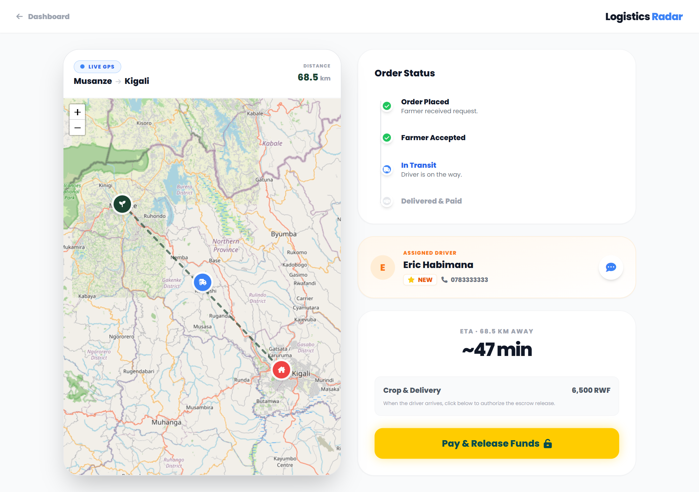
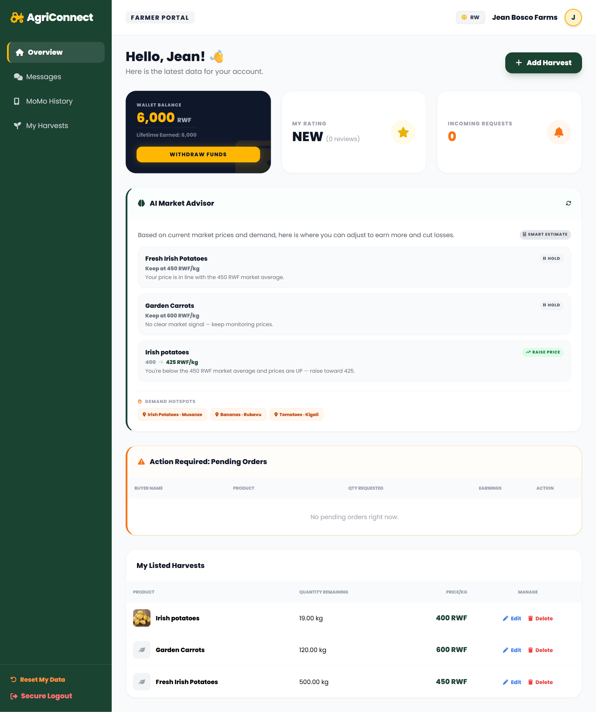
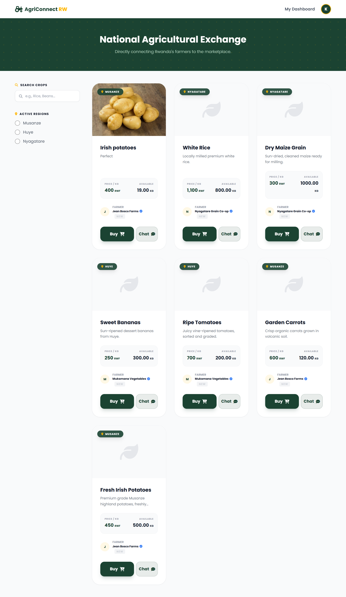
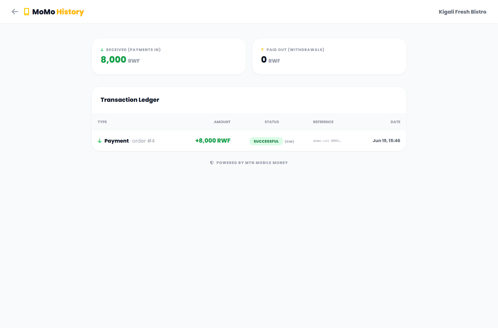
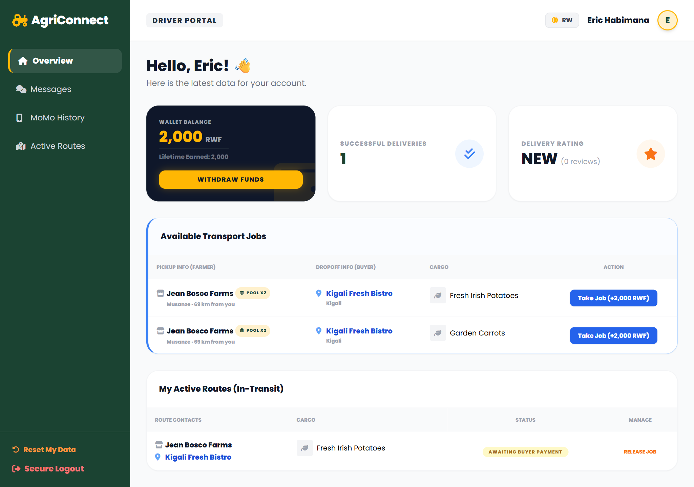
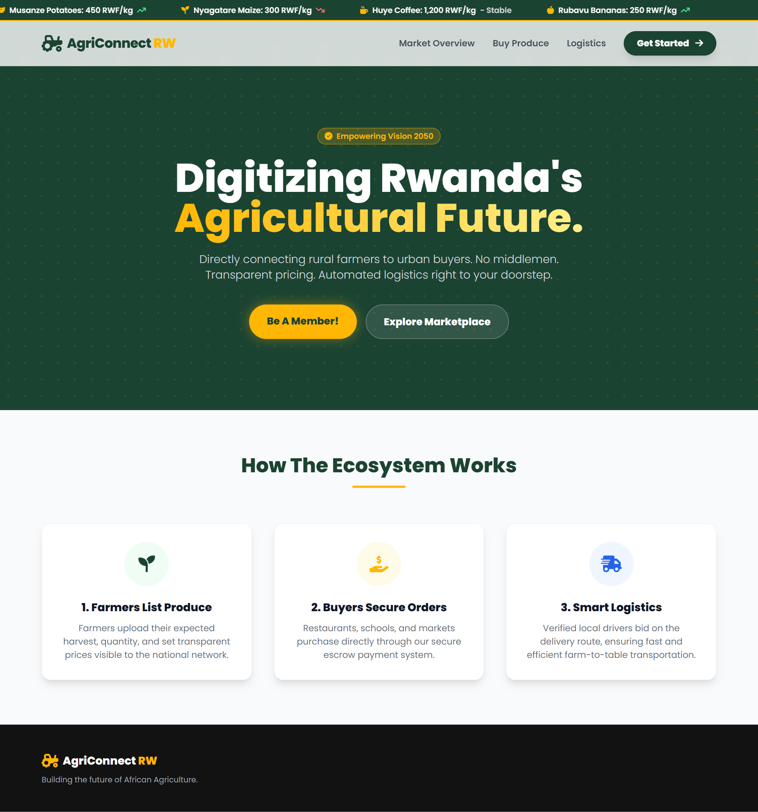
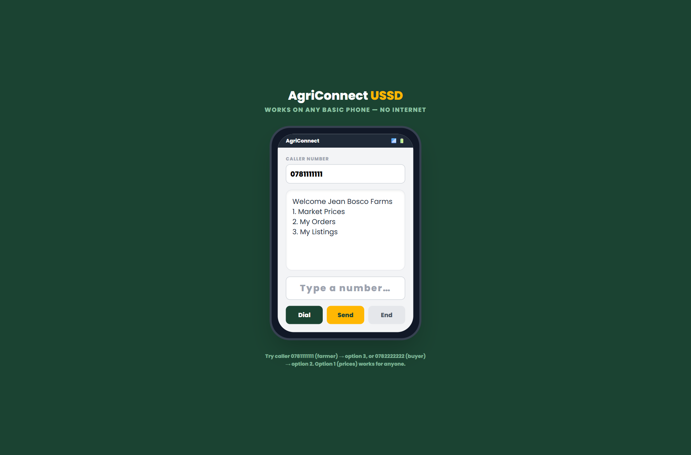

# 🌍 AgriConnect RW

**A digital ecosystem connecting Rwandan farmers, buyers, and transport drivers — with AI pricing intelligence, mobile-money payments, live GPS logistics, and basic-phone (USSD/SMS) access.**

AgriConnect reduces market-access barriers, minimizes post-harvest losses, improves supply-chain efficiency, and increases farmers' profitability.

---

## 📸 Screenshots

### 🚚 Live GPS delivery tracking — real map, real distance & ETA, live driver position

| 🧠 AI Market Advisor (Farmer dashboard) | 🛒 Marketplace |
|:---:|:---:|
|  |  |

| 💸 MoMo transaction history | 🚚 Driver jobs with load-pooling |
|:---:|:---:|
|  |  |

| 🌍 Landing page | 📟 USSD (works on basic phones) |
|:---:|:---:|
|  |  |

---

## ✨ Features

| Area | What it does |
|---|---|
| 🧠 **AI Market Advisor** | AI-powered guidance: optimal price per crop, *sell-now vs hold*, and demand hotspots — from real market data. |
| 💸 **MTN MoMo Payments** | Buyers pay (collection) and farmers/drivers withdraw (disbursement) via Mobile Money, with a full transaction ledger. |
| 🚚 **GPS Logistics + Load-Pooling** | Live OpenStreetMap tracking, real distance/ETA, live driver GPS, and trip-combining so drivers cut empty kilometres. |
| 📟 **USSD + SMS** | Farmers on basic phones check prices/orders by dialing a code; automatic SMS at every order step. |
| 🛒 **3-sided Marketplace** | Farmers list produce, buyers order, drivers deliver — with ratings, in-app chat, and an admin panel. |
| 🌐 **Bilingual** | English / Kinyarwanda. |

> 💡 The AI, MoMo, and SMS integrations run in **simulation mode** out of the box, so the whole app works and demos with **no API keys**. Each goes fully live by adding one config file (see below).

## 🛠️ Tech Stack
- **Backend:** PHP 8.2 (procedural, `mysqli` prepared statements)
- **Database:** MariaDB / MySQL
- **Frontend:** Tailwind CSS, Font Awesome, Leaflet (OpenStreetMap)
- **APIs:** AI advisor (LLM), MTN MoMo (payments), Africa's Talking (USSD/SMS)
- **Runs on:** XAMPP (Apache + MySQL)

## 🚀 Getting Started
1. Clone into your XAMPP `htdocs` folder and start **Apache + MySQL**.
2. Install PHP dependencies: `composer install`
3. Create + seed the database: `php setup_db.php`
4. Open `http://localhost/AgriConnect-RW/`

### Demo logins (phone = username)
| Role | Phone | Password |
|---|---|---|
| Farmer | `0781111111` | `farmer123` |
| Buyer | `0782222222` | `buyer123` |
| Driver | `0783333333` | `driver123` |
| Admin | `0780000000` | `admin123` |

### Going live (optional)
Copy each sample and add your keys (all are git-ignored):
- `includes/ai_config.sample.php` → `includes/ai_config.php` (AI provider API key)
- `includes/momo_config.sample.php` → `includes/momo_config.php`, then run `php momo_provision.php` (MTN MoMo sandbox)
- `includes/sms_config.sample.php` → `includes/sms_config.php` (Africa's Talking)

## 🧪 Try it
- **USSD demo:** open `ussd_sim.php` and dial as `0781111111` → option 3, or `0782222222` → option 2.
- **AI Advisor:** log in as a farmer — it's on the dashboard.
- **Live tracking:** as a buyer, open an in-transit order's tracker.

---

*Empowering Rwanda's agricultural future. 🇷🇼*
